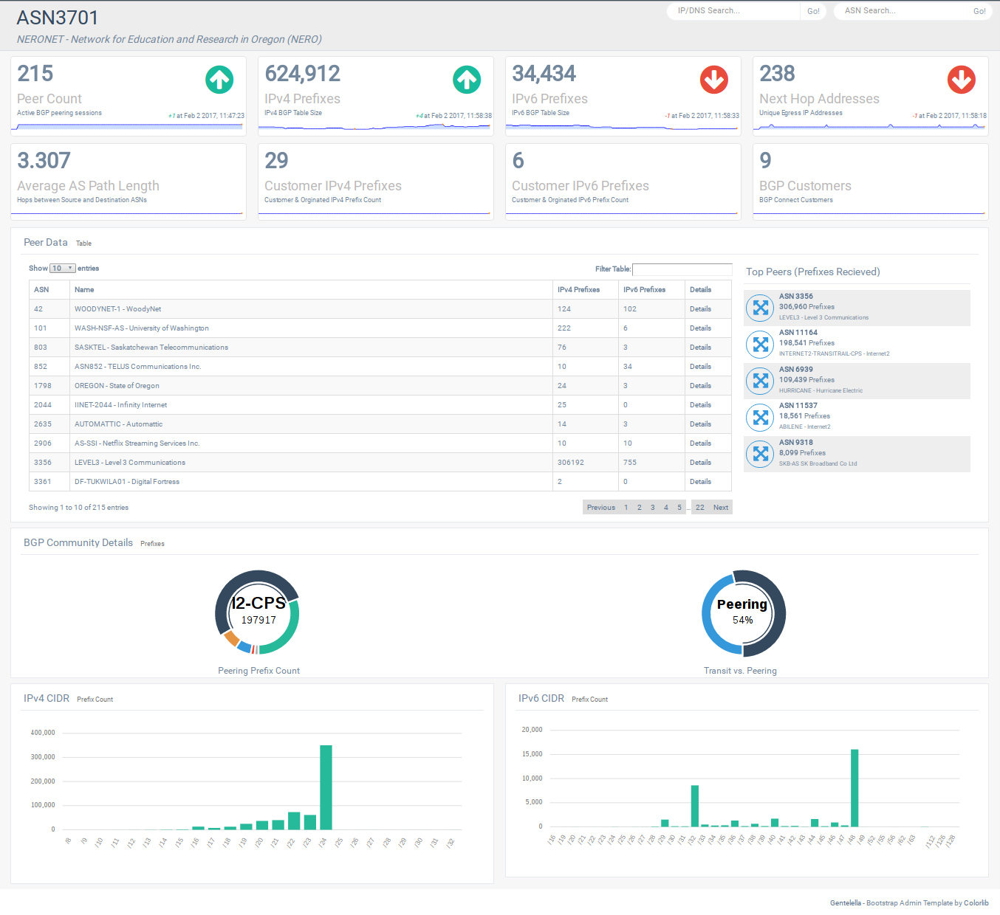

BGP Dashboard
=============

A "realtime" web view of your BGP network

- Who do I peer with?
- How many routes do I receive from my peers?
- Who do I use for tranist?
- What AS path does a prefix take out of my network?
- How many routes and autonomous systems do I see?
- BGP Looking Glass (IPv4/IPv6/ASN)


How it works
---------
> This is beta code.
- BGP peering session using GoBGP
- GoBGP pipes BGP information into MongoDB
- Flask App queries MongoDB to build website and JSON API

###### This project uses three Docker containers
- GoBGP ([osrg/gobgp](https://hub.docker.com/r/osrg/gobgp/))
- MongoDB ([mongo](https://hub.docker.com/_/mongo/))
- Flask ([docker-flask](https://hub.docker.com/r/p0bailey/docker-flask/))

###### GoBGP
The GoBGP container serves two functions:
- Peer with the "real" network
  - Configure [gobgpd.conf](https://github.com/rhicks/bgp-dash/blob/master/gobgp/gobgpd.conf) to peer with the real network.
  - Only IPv4-Unicast and IPv6-Unicast supported at this time.
- Pass BGP updates into BGP
  - The [gobgp_to_mongo.py](https://github.com/rhicks/bgp-dash/blob/master/gobgp_to_mongo.py) script pipes the JSON updates from GoBGP into the MongoDB container

###### MongoDB
- Mongo receives JSON updates from the GoBGP container
- The Flask App queries Mongo for relevant information

###### Flask
- Flask presents a Dashboard for realtime BGP updates
- A JSON API is used on the backend to support the frontend and display Looking Glass queries


Screenshot
---------



Install
---------
```
$ git clone https://github.com/rhicks/bgp-dashboard.git
$ cd bgp-dashboard
$ # modify ./gobgp/gobgpd.conf to peer with your network
$ # modify ./flask/app/constants.py globals to use your ASN and BGP communities
$ docker-compose build
$ docker-compose up (watch the log to verify BGP peeering is established)
```


Todo
---------
- ???
